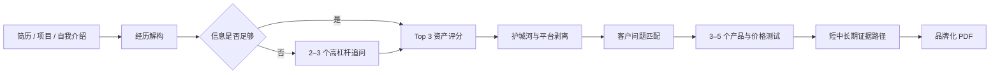

<p align="center">
  <a href="https://github.com/OWENWANG-GULIAI">
    
  </a>
</p>

<div align="center">

# Skill-AssetDistiller｜经验资产提炼器

**把简历和职业经历提炼成可验证、可交付、可测试定价的商业资产清单**

Experience-to-offer diagnostics for an evidence-bound one-person business.

[](LICENSE)

</div>

> **定位**：面向希望把个人经验转化为咨询、课程、工作坊、具体服务或工具包的人，生成经验资产、付费客户、产品优先级和行动路径诊断。<br>
> **不做什么**：不润色普通简历，不把岗位、证书、知名客户或学员好评直接包装成商业结果，也不承诺收入和转化率。

## 导航

- [为什么需要它](#为什么需要它)
- [快速开始](#快速开始)
- [使用方法](#使用方法)
- [工作原理](#工作原理)
- [核心能力](#核心能力)
- [适用场景](#适用场景)
- [输入与输出](#输入与输出)
- [隐私与边界](#隐私与边界)
- [开源许可证](#开源许可证)

## 为什么需要它

职场经历不自动等于商业资产。只有能解决高价值问题、包含个人关键判断、形成明确交付物、可以脱离原平台复用，并且有人愿意验证付费的部分，才值得产品化。

本 Skill 使用以下变现原点组织判断：

> **我有的 × 别人需要的 × 我愿意长期做的**

最终定位必须落到具体人群、触发场景、问题代价、方法机制和可观察结果，并明确区分用户事实、模型推断、待验证假设和行动建议。

## 快速开始

### 1. 安装 Skill

```bash
git clone https://github.com/OWENWANG-GULIAI/skill-assetdistiller.git \
  ~/.codex/skills/skill-assetdistiller
```

### 2. 安装 PDF 生成依赖

```bash
python3 -m pip install reportlab
```

PDF 默认使用 HarmonyOS Sans SC。请安装官方原始字体，或将未经修改的以下文件放入 `assets/`：

- `HarmonyOS_Sans_SC_Regular.ttf`
- `HarmonyOS_Sans_SC_Medium.ttf`
- `HarmonyOS_Sans_SC_Bold.ttf`

### 3. 发起诊断

```text
请使用经验资产提炼器分析这份简历。重点告诉我：
1. 哪三项经验最值钱；
2. 可以为谁解决什么问题；
3. 明天能测试什么产品；
4. 哪些结论仍需要补证据。
```

预期输出是一份包含 Top 3 经验资产、潜在付费客户、3–5 个产品、价格测试、专家追问与阶段化行动路径的 GULIAI 品牌化 PDF。

## 使用方法

1. 提供简历、项目描述、自我介绍或作品证据，不需要先整理成固定格式。
2. Skill 先给出初步资产信号；资料过薄时，只追问 2–3 个最能改变判断的问题。
3. 可以继续补充，也可以明确跳过；跳过时仍会生成保守版诊断。
4. 使用报告数据 Schema 组织结论，并调用 PDF 生成器形成正式报告。

## 工作原理



用户不回答追问时，Skill 仍会生成保守版报告；缺失信息会降低成熟度或优先级，不会被自动补成事实。

## 核心能力

- 从场景、挑战、个人责任、关键决策、动作、交付物、结果证据和可迁移方法解构经历。
- 用五维评分选出且只选出 Top 3 经验资产，并展示评分依据与证据缺口。
- 区分个人可带走资产与依赖原公司品牌、团队、数据、预算和权限的平台资产。
- 围绕具体买家、触发场景、问题代价和替代方案，形成 3–5 个变现切入点。
- 用客户紧迫度、经验匹配、交付可控性、付款者清晰度和低成本验证进行产品排序。
- 采用反向定价：按问题价值、交付物、责任范围与证据强度给出测试价格，不按工时直接推价。
- 输出 1.5 倍行距、白底金色系、包含矩阵、热力表、评分条和价格阶梯的 A4 PDF。

## 适用场景

- 盘点哪些职业经历适合发展为副业或一人公司产品。
- 从项目经历中寻找咨询、课程、工作坊、具体服务或工具包方向。
- 判断某项经验是否具有平台外可迁移性和高客单潜力。
- 为个人商业定位建立客户、产品、价格与证据验证路径。
- 不适用于只想修改措辞、制作求职简历或获得收入保证的需求。

## 示例

[`sample-report.json`](sample-report.json) 是完全虚构的“示例顾问 A”数据，只用于展示字段结构、评分机制和 PDF 生成效果，不代表真实个人、客户、采购或收入结果。

生成示例：

```bash
python3 scripts/generate_pdf_report.py \
  --json sample-report.json \
  --output sample-report.pdf \
  --logo assets/guliai-logo-transparent.png
```

## 输入与输出

| 类型 | 内容 |
|---|---|
| 输入 | 简历、项目描述、职业经历、自我介绍、作品与结果证据 |
| 中间数据 | 符合 [`references/report_schema.json`](references/report_schema.json) 的 JSON |
| 输出 | Top 3 资产评估、客户画像、产品清单、首选产品、专家追问、阶段路径和证据台账 PDF |

## 仓库结构

- [`SKILL.md`](SKILL.md)：Skill 入口、工作流和行为边界
- [`references/`](references/)：资产提炼、访谈、护城河、定价和报告结构
- [`scripts/generate_pdf_report.py`](scripts/generate_pdf_report.py)：PDF 生成器
- [`sample-report.json`](sample-report.json)：虚构示例数据
- [`tests/`](tests/)：Schema、Skill 行为与 PDF 回归测试
- [`assets/`](assets/)：透明 Logo 与字体许可说明

## 质量保证

当前版本包含 12 项自动化测试，覆盖 Top 3 数量约束、评分计算、访谈触发、产品数量、1.5 倍行距、品牌色、PDF 九章结构和深色页面检查。

运行测试需要 `reportlab`、`pypdf`、`Pillow` 和可用的 `pdftoppm`：

```bash
python3 -m pip install reportlab pypdf Pillow
python3 -m unittest discover -s tests -v
```

## 隐私与边界

- 公开示例不得包含真实姓名、客户名单、私聊、内部项目、合同、采购数据或本机绝对路径。
- 客户名称、Logo、案例、截图和结果数据必须标注核验与公开授权状态。
- 学员好评属于体验证据，不自动等于业务 ROI。
- 测试价格是验证假设，不是行业统一价格或收入承诺。
- “能讲课”不自动等于“能诊断、咨询或承担实施”。

## 当前版本边界

- 报告质量取决于输入证据；信息不足时只能形成保守版判断。
- PDF 生成需要本地 Python、ReportLab 和可嵌入的 HarmonyOS Sans SC 字体。
- 当前生成器聚焦 A4 中文咨询报告，没有验证其他语言和页面尺寸。

## 参与贡献

提交问题时请使用虚构或充分脱敏的数据复现，不要上传真实客户材料、个人简历、合同、私聊和未经授权的品牌资产。

## 开源许可证

本仓库采用 [MIT License](LICENSE) 开源。你可以使用、复制、修改、分发和商用，但必须保留原始版权声明和许可证文本。

MIT 许可证不授予 GULIAI 名称及 Logo 的商标权，也不得暗示修改版或衍生产品得到 GULIAI 官方认可、认证或背书。HarmonyOS Sans 字体未包含在仓库中，使用时遵循其独立许可。详见 [`NOTICE.md`](NOTICE.md) 与 [`assets/FONT-NOTICE.md`](assets/FONT-NOTICE.md)。

---

把经历写得更漂亮并不难；难的是判断哪一段经历真正值得客户付费验证。
